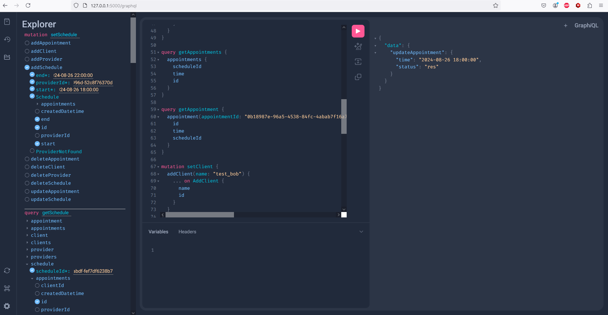

# reservation-api
A simple backend API for appointment scheduling

## Running

- Requires Python 3.10 or newer and Postgresql
- Install requirements with `pip install -r requirements.txt`
- Run with `fastapi run` or `fastapi dev main.py` for dev mode
- Navigate to `http://127.0.0.1:8000/graphql` for the GraphiQL UI
- Write queries to your hearts content! (warning there is no data pre load currently)

## Stack

Uses the following tech:
- FastAPI
- GraphQL
- Strawberry
- Postgres
- Alembic
- Uvicorn

## Future improvements

This is an alright start given the time limitations and striving to learn new tech pieces while developing it however there are a number of shortcomings. First and foremost there is no testing yet included, this is a large oversight but would be fairly quick to remedy. Next up would be containerization which would go a long way to getting it more cloud ready. Environment management and actual database migrations would round out the app nicely along side a CI/CD setup. There is also a large amount of code clean up that could be done as things got a bit messy as I tried to use assorted resources to get past road blocks quickly. Past a deploy stage monitoring and logging would be important as well as changing out user identification, management and auth.

